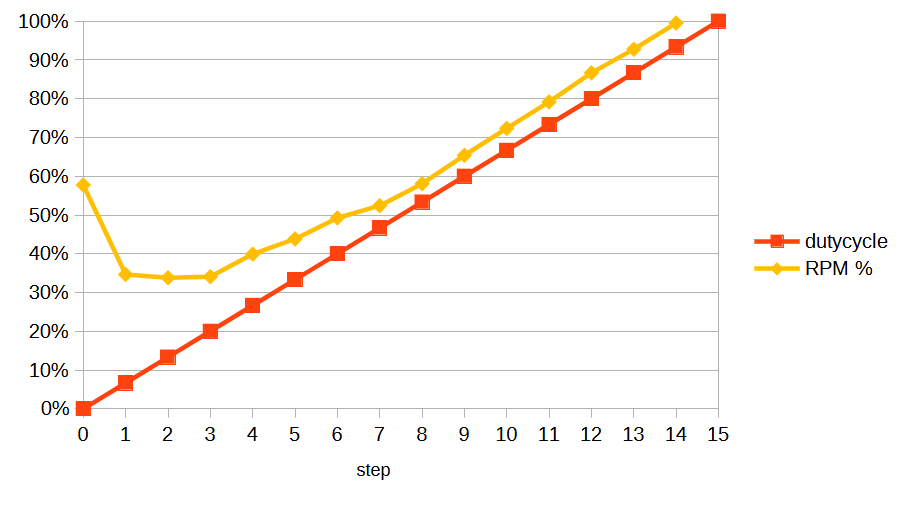

# discoveries

## specification for PWM computer fans

As specified by Intel (c.f. “4-Wire Pulse Width Modulation (PWM) Controlled Fans”, Intel Corporation September 2005, revision 1.3), the square wave type PWM signal has to be  supplied to the PWM input (pin 4) of the fan and must conform to the following specifications:

 - Target frequency: 25kHz, acceptable range 21kHz to 28kHz
 - Maximum voltage for logic low: VIL=0,8V
 - Absolute maximum current sourced: Imax=5mA (short circuit current)
 - Absolute maximum voltage level: VMax=5,25V (open circuit voltage)
 - Allowed duty-cycle range 0% to 100%

## PWM_F and PWM_D

The number of available steps depends on the PWM_F and PWM_D registers. These values can't be chosen freely. In order to conform to the Intel specification (21-28kHz) the EMC2101 should use the following settings:

- PWM_F = 0x08
- PWM_D = 0x01

This will result in a PWM frequency of 22.5 kHz with 16 fan speed settings.

Higher PWM_F values would result in a PWM frequency that is too low. Lower PWM_F values would reduce the number of available fan speed steps. Theoretically PWM_F = 0x04 and PWM_D = 0x02 would work as well but that would reduce the number of available fan speed settings to 8.

## fan speed step, duty cycle and fan rpm

The relationship between PWM dutycycle and fan RPM is non-linear.

Here's an example for a BeQuiet! Silent Wing 3. (Other fans may behave differently.)

__observations__
- Step 0 is probably treated as 'no signal' and results in ~50% speed.
- Steps 1 and 2 are clamped to the 20% value.
- Steps 3..14 have a mostly linear relationship between duty cycle and RPM.
- Step 14: A dutycycle of 93% results in maximum fan speed.
- Step 15: EMC2101 returns impossibly high RPM values (~28k RPM).

__conclusions__
 - steps 0 and 15 should be avoided
 - steps 1, 2 and 3 should be verified for each fan
 - it's impossible to predict RPM without knowing the minima for RPM and dutycycle

__raw values__
| step | duty cycle | RPM  | RPM% |
|------|------------|------|------|
|   0  |       0.0% |  693 |  58% |
|   1  |       6.7% |  416 |  34% |
|   2  |      13.3% |  406 |  34% |
|   3  |      20.0% |  409 |  34% |
|   4  |      26.7% |  479 |  40% |
|   5  |      33.3% |  526 |  44% |
|   6  |      40.0% |  591 |  49% |
|   7  |      46.7% |  629 |  52% |
|   8  |      53.3% |  697 |  58% |
|   9  |      60.0% |  785 |  65% |
|  10  |      66.7% |  868 |  72% |
|  11  |      73.3% |  950 |  79% |
|  12  |      80.0% | 1040 |  87% |
|  13  |      86.7% | 1113 |  93% |
|  14  |      93.3% | 1194 | 100% |
|  15  |     100.0% |  ??? |  ??? |

_duty cycle formula: `dutycycle = step / (PWM_F*2)-1`_
